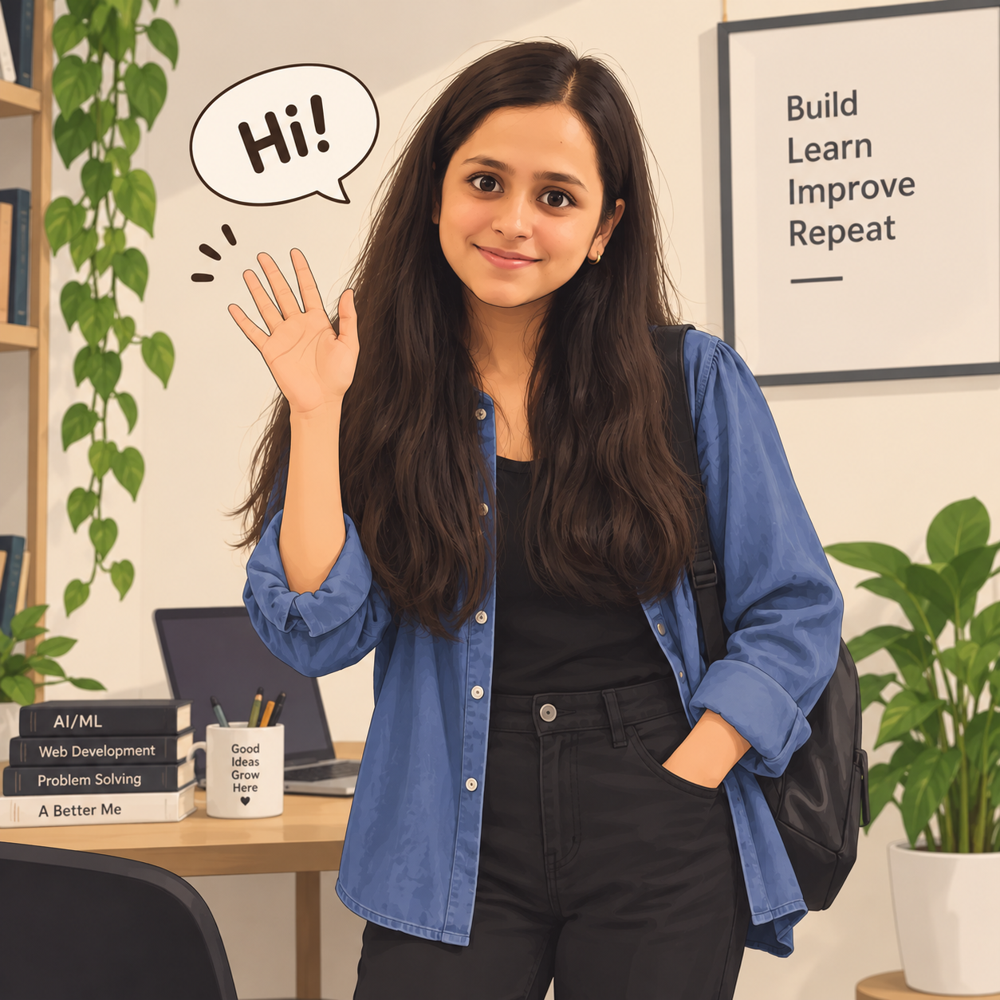

<table align="center">
  <tr>
    <td align="center" width="800">
      
        
      <h1>Hi there, developer, what's up?</h1>
      
<strong>Wanna know about me? Please explore here (<a href="https://abhilasha-portfolio-zeta.vercel.app/">Portfolio</a>).</strong>

    </td>
  </tr>
</table>

  <strong>Software Engineer · AI/ML · Backend · Full-Stack</strong>

  Ex-SDE Intern @ Amazon · Ex-Junior AI Engineer @ PingAura.ai · B.Tech CSE, Thapar ’26

  

  

  

  

  <a href="#featured-projects">Projects</a> ·
  <a href="#experience">Experience</a> ·
  <a href="#co-curricular-societies">Societies</a> ·
  <a href="#technical-skills">Skills</a> ·
  <a href="#research">Research</a> ·
  <a href="#contact">Contact</a>

  

 

---

## About Me

I work at the overlap of **backend engineering** and **applied machine learning**: APIs and services on one side, computer-vision and forecasting pipelines on the other.

I completed an **SDE internship at Amazon** (Jan-Jun 2026, Gurugram) and was a **Junior AI Engineer at PingAura.ai** (Jun-Dec 2025, remote). I am a **B.Tech** student in **Computer Science and Engineering** at **Thapar Institute of Engineering & Technology (TIET), Patiala**, class of **2026**.

I enjoy **competitive programming** (DSA, contests, problem-solving) alongside building software.

Open to full-time **SDE**, **Backend**, **Full-Stack**, and **AI/ML Engineer** roles.

---

## Experience

Roles in short. For code and product detail, see the projects below or my [portfolio](https://abhilasha-portfolio-zeta.vercel.app/).

### Amazon - Software Development Engineer Intern
**Gurugram · Jan 2026 - Jun 2026**

SDE intern on backend systems (AWS, services, testing).

### PingAura.ai - Ex-Junior AI Engineer
**Remote · Jun 2025 - Dec 2025**

Built AI-backed product features: Python, LLM APIs, prompt engineering, and RAG on the backend, plus full-stack work in React/Next.js and FastAPI.

### Thapar Institute of Engineering and Technology - Research Associate
**Jun 2024 - Aug 2024 · Advisor: Dr. Sandeep Mandia**

EEG-based mind-wandering detection with CNN-LSTM models. Co-authored a paper presented at **THEC 2025** (Best Paper Award).

---

## Co-curricular / Societies

Campus roles, one line each. More on my [portfolio](https://abhilasha-portfolio-zeta.vercel.app/).

- **Microsoft Learn Student Chapter, TIET** - Core Member, backend (Node.js / Express)
- **Thapar Toastmasters** - Core Member; speaking and debating; taught 100+ juniors public speaking
- **AIESEC** - Outgoing Global Volunteer

---

## Featured Projects

<table>
<tr>
<td width="50%" valign="top">

### Solar IQ
**Computer-vision solar-panel monitoring**

Capstone · Jan-Nov 2025 · TIET  
Role: **full-stack and AI/ML**

A camera (or video file) feeds frames into a **Vision Transformer** - `ViTForImageClassification` on `google/vit-base-patch16-224`, weights in `best_vit_model.pth`. Each frame is labeled as **Bird-drop**, **Clean**, **Dusty**, **Electrical-damage**, **Physical-damage**, or **Snow-Covered**. `worker.py` stores JPEGs and appends `log.csv`. A **Streamlit** dashboard shows the latest snapshot and class, today’s log, and history filtered by date.

Condition labels map to maintenance actions (dusty → cleaning required; clean → no action). **Twilio** sends a status SMS on a **configurable interval (default every 3 hours)**, for example `Status: Clean - No maintenance required`.

Hardware in the capstone: Loom Solar panel, camera, ESP32-class board and sensors (hardware and integration with teammates).

| | |
| --- | --- |
| **Tech** | Python, PyTorch, Hugging Face Transformers, OpenCV, Streamlit, pandas, Twilio |
| **Highlight** | Frame → ViT class → operator dashboard, with timed SMS status for remote operators |

[GitHub](https://github.com/abhilashatiwa/SolarIQ) · [Project note](https://www.linkedin.com/feed/update/urn:li:activity:7403162659749007360/)

</td>
<td width="50%" valign="top">

### PopSeat
**Full-stack movie ticketing**

React + Express app for shows, seat maps, occupancy, and checkout.

**MongoDB** bookings, **Clerk** auth, **Stripe Checkout** (webhooks + session metadata), **Inngest** to check payment status after booking, **Cloudinary** and **Nodemailer**.

| | |
| --- | --- |
| **Tech** | React, Vite, Tailwind CSS, Node.js, Express, MongoDB, Clerk, Stripe, Inngest |
| **Highlight** | Seat-availability checks plus Stripe sessions and async payment follow-up |

[GitHub](https://github.com/abhilashatiwa/PopSeat-FullStack) · [Live link](https://popseat-client.vercel.app/)

</td>
</tr>
<tr>
<td width="50%" valign="top">

### QuickChat
**Realtime chat**

Express REST for **auth** and **messages**; **Socket.IO** for online presence (`userSocketMap`, `getOnlineUsers`). **JWT**, **bcryptjs**, **MongoDB**, **Cloudinary**. React client with auth and chat context.

| | |
| --- | --- |
| **Tech** | React, Vite, Tailwind CSS, Node.js, Express, Socket.IO, MongoDB, JWT |
| **Highlight** | HTTP API plus WebSocket presence on JWT-backed accounts |

[GitHub](https://github.com/abhilashatiwa/QuickChat-Full-Stack) · [Live link](https://quick-chat-client-rosy.vercel.app/login)

</td>
<td width="50%" valign="top">

### Predictive Maintenance
**ML + Flask (earlier project)**

Login by machine id. **RandomForestClassifier** for whether preventive maintenance is needed; **RandomForestRegressor** for estimated days. Training uses **GridSearchCV** and **StandardScaler**. HTML UI with a JSON history/schedule view.

The regression target in training is **derived from the failure flag**, not a separate remaining-life label - treat the day estimates as a prototype.

| | |
| --- | --- |
| **Tech** | Python, Flask, scikit-learn, pandas, HTML |
| **Highlight** | Train → pickle → form-based inference, with a clear limit on the regression labels |

[GitHub](https://github.com/abhilashatiwa/predictive_maintainence)

</td>
</tr>
</table>

---

## Research

**Comparative Study of Tree-Based Ensembles, CNN-LSTM, and State Space Model for Photovoltaic Power Forecasting**  
IEEE IATMSI 2026 - accepted and presented virtually.

Compared **XGBoost**, **Random Forest**, **CNN-LSTM**, and a **state-space / Mamba** pipeline for PV power forecasting.

[doi:10.1109/IATMSI68868.2026.11465902](https://doi.org/10.1109/IATMSI68868.2026.11465902)

**Deep Learning Framework for EEG-Based Mind Wandering Detection in Education**  
Co-authored under Dr. Sandeep Mandia (transfer learning / deep learning on EEG). Presented at **THEC 2025**; **Best Paper Award**.

A further manuscript, *Comprehensive framework for solar panel maintenance*, is **under review** at IEEE.

---

## Technical Skills

| | |
| --- | --- |
| **Languages** | Python, JavaScript, C++, C, Java, SQL |
| **Backend** | Node.js, Express.js, FastAPI, REST APIs, Flask, Spring Boot |
| **Frontend** | React.js, Next.js, HTML, CSS, Tailwind CSS |
| **Data stores** | MongoDB, PostgreSQL |
| **Cloud & tools** | AWS (Lambda, EC2, S3, RDS), Git, GitHub, CI/CD |
| **ML / CV** | PyTorch, Hugging Face Transformers, OpenCV, scikit-learn, pandas, Streamlit, LLMs, RAG |
| **App services** | JWT, Clerk, Stripe, Socket.IO |
| **CS** | DSA, OOP, OS, networks, security |

---

## Currently

- Iterating on **Solar IQ** (ViT monitoring, dashboard, SMS alerting)
- Open to full-time **SDE / backend / full-stack / AI-ML** roles
- Deepening backend, cloud, and testing practice alongside applied CV/ML

---

## Education

**B.Tech, Computer Science and Engineering**  
Thapar Institute of Engineering & Technology, Patiala · 2022 - 2026

- Merit-3rd scholarship - top 10% of the branch, 2nd year (2023-2024)
- NSEJS - top 10% nationally (48,300+ candidates)

---

## GitHub

Public account since June 2023. Stats are pulled live from GitHub (rank letter hidden).

  
  

---

## Contact

- **Email:** [tiwariabhilasha8765@gmail.com](mailto:tiwariabhilasha8765@gmail.com)
- **LinkedIn:** [linkedin.com/in/abhilasha293](https://www.linkedin.com/in/abhilasha293)
- **GitHub:** [github.com/abhilashatiwa](https://github.com/abhilashatiwa)
- **Portfolio:** [abhilasha-portfolio-zeta.vercel.app](https://abhilasha-portfolio-zeta.vercel.app/)

 

*SDE · Backend · Full-Stack · AI/ML - Thapar CSE ’26*

